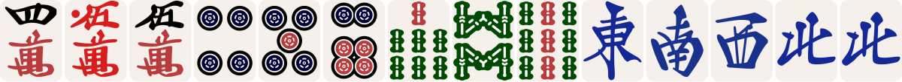

# mahjong-render

[](https://rubygems.org/gems/mahjong-render)
[](https://github.com/kjun1/mahjong-render/actions/workflows/ci.yml)

[日本語版 README](README.ja.md)

`mahjong-render` is a Ruby library that turns compact riichi mahjong notation into a self-contained SVG. It also provides an optional block macro for Ruby Asciidoctor. Rendering works offline and does not require Node.js, a browser, a font, or a network service.

## Example output

`405m456p789s12344z` renders as:



The `0m` in `405m` is a red five. The preview is generated from the library's SVG output.

## Install and render

Requirements: MRI Ruby 3.3 or newer. See [Compatibility and support](#compatibility-and-support) for the tested versions.

Install the published gem from RubyGems:

```sh
gem install mahjong-render
```

To install a build from a local checkout:

```sh
gem build mahjong-render.gemspec
gem install --local ./mahjong-render-0.2.0.gem
```

Render a hand from the command line or from Ruby:

```sh
ruby -rmahjong_render -e 'print MahjongRender.render("405m456p789s12344z")' > hand.svg
```

```ruby
require "mahjong_render"

svg = MahjongRender.render("405m456p789s12344z")
File.write("hand.svg", svg)
```

The result is one SVG string with tile images embedded as data URIs. It can be saved as a file or inserted into HTML. The tile count is unrestricted; the library draws the sequence and does not check whether it is a legal hand.

## AsciiDoc usage

Install Asciidoctor separately, then load the adapter using the usual Ruby Asciidoctor `-r` option. These commands create `hand.html` from a standalone document:

```sh
gem install asciidoctor
printf '= Mahjong hand\n\nmahjong::405m456p789s12344z[]\n' > hand.adoc
asciidoctor -r mahjong_render/asciidoctor hand.adoc
```

See [the complete AsciiDoc example](examples/basic.adoc) for hands with and without extra space.

To show separate groups, insert `|` between complete tile groups: `mahjong::123m|456p|789s[]`. Each `|` adds a quarter tile width of empty space, the same as `|(0.25)`. Use `|(0.5)` for half a tile width or `|(1)` for a full tile width, for example `mahjong::123m|(0.5)456p[]`.

The adapter supports the HTML5 backend. Macro attributes, inline macros, and PDF output are unsupported. The Ruby rendering API does not load Asciidoctor.

## Supported notation

| Form | Meaning |
| --- | --- |
| `1m`–`9m` | Characters (manzu) |
| `1p`–`9p` | Circles (pinzu) |
| `1s`–`9s` | Bamboo (souzu) |
| `1z`–`4z` | East, South, West, North |
| `5z`–`7z` | White, Green, Red dragon |
| `0m`, `0p`, `0s` | Red five in the corresponding suit |

Digits can share a suit suffix: `123m` means `1m 2m 3m`, and `405m` means `4m 0m 5m`. Therefore `10m` is two tiles (`1m 0m`), not a rank-ten tile. Whitespace is allowed between complete groups but does not change their spacing. The normal gap remains 12 SVG units; `|` adds 75 units, and `|(0)` adds nothing. Numeric widths must be nonnegative decimal values. Separators must be between complete groups.

Invalid notation raises `MahjongRender::NotationError`, with `token`, zero-based character `position`, and `reason` readers. Examples include `8z`, `123x`, `1m!`, a missing suit, and empty input. For example, `MahjongRender.render("8z")` raises an error with `token == "8z"` and `position == 0`.

See the [public API reference](docs/api.md) for method and error details.

## Compatibility and support

The supported runtimes for v0.2.x are MRI Ruby 3.3, 3.4, and 4.0. The optional Asciidoctor adapter is tested with Ruby Asciidoctor 2.x and its HTML5 backend. Other Ruby implementations, Asciidoctor versions, and backends are outside the supported set. Ruby 3.2 is no longer supported because it has reached upstream end of life.

During the 0.x series, breaking changes are announced in a minor release. Fixes and security updates are provided only for the latest minor release line; v0.2.x supersedes v0.1.x. See [support information](SUPPORT.md), the [security policy](SECURITY.md), and the [code of conduct](CODE_OF_CONDUCT.md).

## Architecture

```text
notation → strict Ruby parser → ordered tile codes → SVG composer
                                               ↑
                                  pinned CC0 tile artwork

AsciiDoc → Ruby Asciidoctor block macro → MahjongRender.render
```

The parser and SVG composer are intentionally small. Existing renderers were evaluated before this choice; [the research](docs/research/existing-renderers.md) and [decision records](docs/adr/) explain why they were not used as Ruby runtime dependencies.

## Development

Open this repository in a devcontainer, or use a supported MRI Ruby with Bundler and `rsvg-convert` installed:

```sh
bundle install
bundle exec rake lint test assets:check licenses:check example:build
gem build mahjong-render.gemspec
ruby script/check_package.rb mahjong-render-0.2.0.gem
```

The example HTML is written to `tmp/basic.html`. The test suite rasterizes a sample SVG to confirm the embedded vector artwork renders.
The [release guide](docs/release.md) describes the tag-triggered Trusted Publishing workflow.

To regenerate the README preview with `rsvg-convert`:

```sh
ruby -Ilib -rmahjong_render -e 'print MahjongRender.render("405m456p789s12344z")' | rsvg-convert -w 1200 -o examples/hand.png
```

## Third-party components and license

Copyright 2026 Maejima Kenya. The project Ruby code and text documentation are licensed under [Apache-2.0](LICENSE). The bundled tile artwork and the [README preview](examples/hand.png) are CC0-1.0. The artwork comes from [FluffyStuff/riichi-mahjong-tiles](https://github.com/FluffyStuff/riichi-mahjong-tiles); see [third-party notices](THIRD_PARTY_NOTICES.md), [the asset manifest](assets/manifest.json), and [the CC0 legal text](LICENSES/CC0-1.0.txt). The gem metadata lists both licenses; each applies to the components described here.
